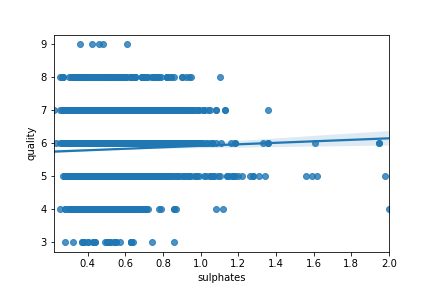

# Portuguese Vinho Verde: What Chemical Properties Are Significantly Associated With Blind Ratings of Wine Quality?
 
Disclaimer: I made decisions about these analyses with a misunderstanding of what the t-statistic represents. I interpreted it as an indicator of feature impact, when in fact it is an indicator of confidence in the feature impact being what it is. In order to accurately estimate feature impact, features need to be normalized in order to be compared via their beta coefficients.

## Table of Contents
* [Overview](#overview)
* [Data](#data)
* [Modeling](#modeling)
* [Results](#results)
* [Prediction](#prediction)
* [Future](#future)
* [Summary](#summary)
* [Project Info](#project-info)

Overview
=
This dataset, obtained from [UCI Machine Learning Repository](https://archive.ics.uci.edu/ml/datasets/Wine+Quality), contains eleven columns of chemical properties and one column of blind ratings for 4898 white and 1599 red Vinho Verde wines from Portugal. The original source of this dataset is the 2009 paper [Modeling wine preferences by data mining from physicochemical properties](https://www.sciencedirect.com/science/article/abs/pii/S0167923609001377?via%3Dihub) by Cortez, et al.

Appreciation of wine can be extremely subjective, and can be affected by non-intrinsic properties such as price. Herein, I build a multiple regression model in order to examine the chemical properties of wine that are significantly associated with blind ratings of wine quality.

Data
=
I concatenated the red and white wine datasets in order to increase sample size. Although it is true that red and white wines are qualitatively different in taste, examining the datasets separately did not have any appreciable effect on model strength or coefficient estimates. The dataset was very clean and had no N/A values. The distribution of values for each chemical property was relatively normal, with some properties having asymmetrically fatter tails or seemingly bimodal distributions (this will be relevant later). Given that these were accurate chemical measurements, there were no extreme outliers that had to be removed.

Modeling
=
First, I split the dataset, with 80% for training and 20% for testing. Then, I ran a multiple regression with the eleven chemical properties as features and the quality rating as target. Multicollinearity was examined with VIF for each feature. Density had a VIF of 15.3 due to it having a high positive correlation with residual sugar and high negative correlation with alcohol. This makes sense, as [more alcohol = less dense] and [more sugar = more dense] because alcohol is less dense than water and sugar is more dense than water. For this reason, density seemed like a feature that could be safely dropped. 

I reran the model without density, and this time, no feature had a VIF > 5. In this model, alcohol was the most significant feature, exhibiting a positive correlation with quality. However, vinho verde alcohol by volume (ABV) is associated with region, and the terroir and winemaking expertise of regions correlates with quality. One [source](https://www.alcoholprofessor.com/blog-posts/blog/2014/04/23/vinho-verde-a-splash-of-summer-vinous-joy) states:

"The alcohol level of 'generic' Vinho Verde must lie between 8% and 11.5% ABV. However, if the wine is labelled with one of the nine sub-regions, which specialise in particular grape varieties, the range extends from 9% to 14% ABV. Additionally, Vinho Verde made from the single varietal Alvarinho can be between 11.5% and 14% ABV. Finally, 'late harvest' Vinho Verde, made from over-ripe grapes with higher residual sugar content, normally has an alcoholic strength of around 15% ABV."

Therefore, ABV is a confounding feature and should be dropped. Even if this hypothesis were false, including ABV in the model would mean that its predictions would be useless to a buyer who specifically desired a low ABV wine, since low ABV wines would be penalized with lower predicted quality scores. The authors of the paper comment on this ("For instance, an increase in the alcohol (4th and 2nd most relevant factor) tends to result in a higher quality wine."), but do not treat it as problematic.

After dropping collinear (density) and confounding (alcohol) features, the multiple regression exhibited an R^2 of 0.144, indicating that the remaining nine features explain ~14% of the variance in quality ratings. While this seems low, it makes sense given that subjective quality ratings are rather noisy and unreliable (compared to an objective feature such as house price). 

Next, I employed backward selection, and removed two features that were non-significant, residual sugar and pH. This barely affected the model, reducing the R^2 from 0.144 to 0.143. 

I employed further backward selection by building a model using only two features, volatile acidity and chlorides. 

[Volatile acidity](https://winemakermag.com/article/676-the-perils-of-volatile-acidity) is a measure of wine spoilage. 

[Chlorides](https://www.scielo.br/scielo.php?script=sci_arttext&pid=S0101-20612015000100095) are a measure of saltiness, which can be caused by terroir or grape varietal. 

Of the remaining features, these "bad wine" features had the strongest correlations with quality rating. However, this model only explained 8% of variance.

To correct for this, I employed a mixed selection strategy--that is, after backward selection, I added back two of the next most significant features, total sulfur dioxide and sulphates. 

Sulfur dioxide is a natural byproduct of wine fermentation and an aid in preserving wine. However, some winemakers will add additional sulfur dioxide for extra preservation. According to one [source](https://learn.winecoolerdirect.com/wine-sulfites/), sulfites in normal quantities have no affect on flavor. However, there is a negative association with quality in the multiple regression. In the total sulfur dioxide histogram, there appears to be a bimodal distribution, perhaps pointing to winemakers who add extra artificial sulfur dioxide in order to compensate for bad winemaking practice/technique. In this case, total sulfur dioxide may be a proxy for bad winemaking practice/technique. 

Sulphates, not to be confused with sulfites, refer to potassium sulfate, which is [used in fertilizer to provide potassium to grapes](https://grapesandwine.cals.cornell.edu/newsletters/appellation-cornell/2018-newsletters/issue-33-may-2018-0/grapes-101/). From the Cortez paper: "The most intriguing result is the high importance of sulphates, ranked first for both cases. Oenologically this result could be very interesting. An increase in sulphates might be related to the fermenting nutrition, which is very important to improve the wine aroma." 

Results
=
At this point, I was satisfied with the model's power, simplicity, and interpretability. Here are the results of the multiple regression.

The two additional features, total sulfur dioxide and sulphates, despite having very small coefficients, resulted in a model with an R^2 of 0.13. This can be understood in the context of each features' univariate regerssion scatterplot.

   

The highest quality wines (with median ratings of 8/9) have low values and low variance for all four features. Thus, these features mostly serve to capture variance in the tails of each quality rating. As an example, not every wine rated 3 has a very high volatile acidity (an indication of spoilage), but there is a wide variance compared to 8/9-rated wines. This "capture of tail behavior" explains why total sulphur dioxide and sulphates add significant explanatory power to the model despite having such low coefficients.

Prediction
=
Using this model, I predicted wine quality ratings in the test set. Given six possible ratings in the test set (3-8), chance performance would be ~17%. After rounding predictions to the nearest integer to match the test set, the model's predictions had a mean difference of 0.6 from the true value. 47% of quality ratings were predicted exactly, and 80% were predicted correctly within one point. By comparison, in Cortez et al., they used a support vector machine model and predicted ~63% of quality ratings exactly, and ~88% within on point. Not bad!

Future
=
Normalize features between 0 and 1 so that coefficients are more interpretable.

Rerun analysis only for very low (rating = 3/4) and very high quality (rating = 8/9) wines.

% correct per rating category. Model might only be "successful" because most wines are rated 6.

Summary
=
The perception of wine quality, even in blind tastings, is extraordinarily complex, and probably involves many more features than the eleven included in this dataset and the four included in this model. While the final model only explained 13% of variance in quality ratings, it was able to perform substantially better than chance on unseen data, and its performance was comparable to published literature. 

We may tentatively conclude from this analysis that the most talented winemakers are able to strictly control the presence of volatile acidity and chlorides, representing spoilage and saltiness respectively, and do not need to add any compensatory preservatives in the form of total sulfur dioxide. The rest of the 87% of unexplained variance may be comprised of a combination of measurement noise and those ineffable qualities that make an excellent wine excellent (perhaps some causally dynamical effect of sulphates!).

Project Info
=
<pre>
Contributors : <a href=https://github.com/aarondzt>Aaron Tan</a>
</pre>

<pre>
Languages    : Python
Tools/IDE    : Anaconda
Libraries    : pandas, seaborn, statsmodels, sklearn
</pre>

<pre>
Duration     : September 2020
Last Update  : 09.20.2020
</pre>
